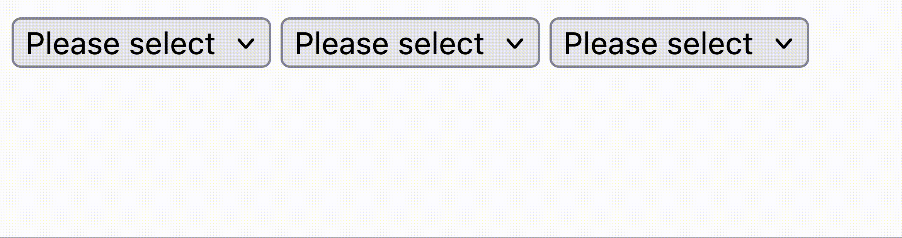

# Dynamic Form

Copyright RoyalZSoftware 2024: Dynamic Form

Author: Alexander Panov <panov@royalzsoftware.de>

## Abstract
This is intended to be a micro library to create forms with select fields that
change based on the selection of forms value

## Demo

## Terminology
- A `form` is not just the html form, but it also contains a state TODO
- A `filter select field` is a select field that reevaluates the select options
of all the select fields inside a `form`
- A `dependent select field` is a select field that does not trigger a reevaluation
of the options when its value changes

## Requirements
1. It should be simple
2. There should be an attribute that creates a `form`: `dyn-form`.
3. There should be an attribute that creates a `filter select field`: `dyn-filter`
4. There should be an attribute that creates a `dependent select field`: `dyn-dependent`
5. At form initialization it is expected that all select fields are rendered in the DOM.
6. When one of the `filter select field`s changes, then reevaluate the available options
for all the select fields
7. To specify the property of an option, pass the `dyn-*` attribute.
8. It is expected that all the options are rendered as <options> inside the select fields at initialization time.
Those will be hidden or shown depending on the filter.
